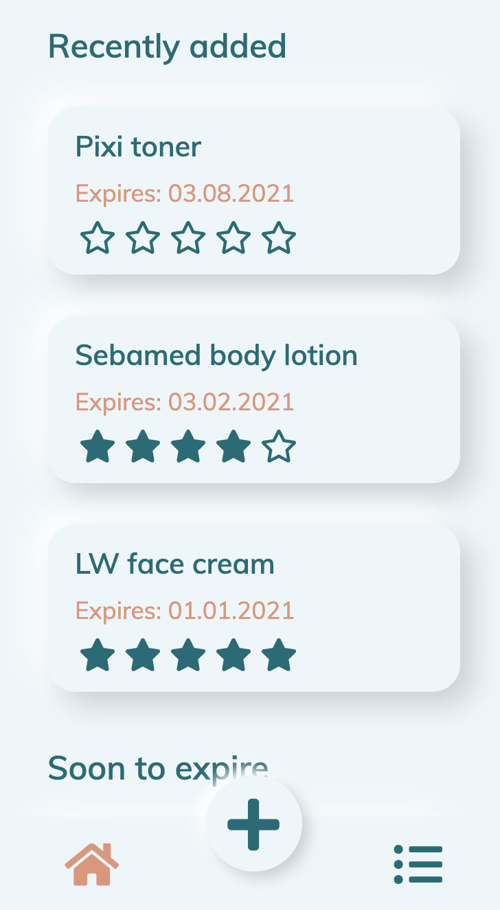
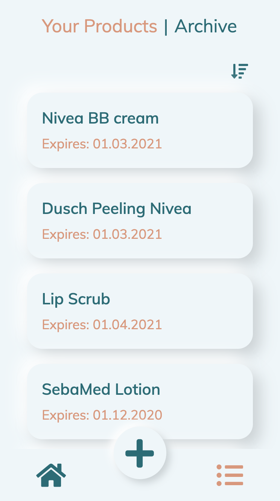

## AppToDate

When did I buy that sunscreen? Is it still good?
**AppToDate** helps you track the expiring dates after opening your products so that you always know if the product is good or not.
With the App you also have a good overview for your products as you can save, update, sort and archive your products.

## Motivation

The App was created as a capstone project for the neue fische Web Development Bootcamp.
The idea for the project came to me as I often found myself wanting an easy way to remember if my cosmetic products are still good and safe to use after a longer period of time.

## Screenshots

You can see the full version of the app here: [https://capstone-project-nu.vercel.app/](https://capstone-project-nu.vercel.app/)

## Tech / frameworks used

React / Redux / React-Router / Jest / React Testing Library / Cypress /
StyledComponents / PropTypes / Storybook / redux-toolkit / redux-undo /
react-flip-move / react-swipe / localForage / Blueprint / Git Workflow /
Sketch / Framer

## Available Scripts

In the project directory, you can run:

### `npm install`

To install the app dependencies.

### `npm start`

Runs the app in the development mode. 
Open [http://localhost:3000](http://localhost:3000) to view it in the browser.

The page will reload if you make edits. 
You will also see any lint errors in the console.

### `npm test`

Launches the test runner in the interactive watch mode. 
See the section about [running tests](https://facebook.github.io/create-react-app/docs/running-tests) for more information.

### `npx cypress open`

Launches the Cypress test runner.

### `npm run build`

Builds the app for production to the `build` folder. 
It correctly bundles React in production mode and optimizes the build for the best performance.

The build is minified and the filenames include the hashes. 
Your app is ready to be deployed!

See the section about [deployment](https://facebook.github.io/create-react-app/docs/deployment) for more information.

### `npm run eject`

**Note: this is a one-way operation. Once you `eject`, you can’t go back!**

If you aren’t satisfied with the build tool and configuration choices, you can `eject` at any time. This command will remove the single build dependency from your project.

Instead, it will copy all the configuration files and the transitive dependencies (webpack, Babel, ESLint, etc) right into your project so you have full control over them. All of the commands except `eject` will still work, but they will point to the copied scripts so you can tweak them. At this point you’re on your own.

You don’t have to ever use `eject`. The curated feature set is suitable for small and middle deployments, and you shouldn’t feel obligated to use this feature. However we understand that this tool wouldn’t be useful if you couldn’t customize it when you are ready for it.
